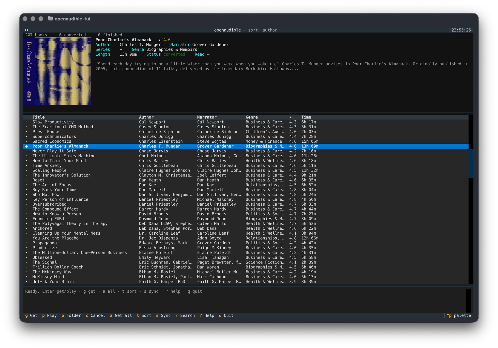

# openaudible-py

**A full-screen terminal app for your Audible library** — sync, de-DRM, convert,
browse, and play **your own** audiobooks. Most Python Audible tools are
command-line only; this one gives you a real, interactive **TUI** — cover art,
live download/convert progress, search, sort, and one-key downloads — with the
CLI still there underneath for scripting.

An open-source Python take on OpenAudible.

> For personal use with your own purchased audiobooks and your own Audible
> credentials. DRM removal runs locally on books you own.

## The TUI

`openaudible-tui` is the main way to use it — a full-screen library browser:

- **Layout** — a library-status bar up top (`207 books · 6 converted · 5 finished`),
  a **book-info panel** (cover, author/narrator/series/genre/rating, description),
  and the **full-width list** below.
- **Searchable, sortable list** (author / title / recently bought) with columns for
  title, author, narrator, genre, rating, and length.
- **Cover art** — crisp in terminals that support graphics
  (Kitty / Ghostty / WezTerm / iTerm2 / Sixel), half-block fallback elsewhere.
- **One-key get** — `Enter` or `g` downloads + strips DRM + converts to M4B in the
  background, with **live progress** (`⏬ downloading 45% · 96/212 MB` → `⚙ converting 62%`).
- **Background job queue** — up to 2 at once, the rest queue; `c` cancels a queued
  job instantly or terminates a running one. Interrupted downloads resume.
- **Built-in player** — `p` plays in-app (`space` pause, `[`/`]` chapter, `-`/`=` speed, `f`/`b` ±30s).
- **Read status** — `m` cycles unread → reading → finished → dnf.
- **Edit metadata** — `e` opens an inline editor; `F` auto-fills from Audible.
- **Companion PDFs** downloaded alongside the M4B; **notes/bookmarks** via `n`.
- **Auto login** — opens a browser to sign in on first launch; no copy/paste.

It also handles **chapters + cover art** (preserved losslessly), **import** of your
own local audiobooks, and **export** of the catalog to CSV/JSON.

### Keys

| Key | Action |
|-----|--------|
| `Enter` | get if new, play if already converted |
| `g` / `a` | get selected / get all un-converted in view |
| `c` | cancel this book's job (queued or running) |
| `p` / `o` | play (built-in) / open the book's folder |
| `m` / `n` | cycle read status / show notes & bookmarks |
| `e` / `F` | edit metadata / auto-fill from Audible |
| `t` / `/` | sort (author → title → recent) / search |
| `s` | sync library from Audible |
| `l` / `L` | log in (browser) / log out |
| `r` / `esc` / `?` / `q` | refresh / clear search / help / quit |
| `j` `k`, arrows, PgUp/PgDn, Home/End, `Ctrl+U`/`Ctrl+D` | move |
| **player:** `space` `x` `[` `]` `-` `=` `f` `b` | pause · stop · prev/next chapter · slower/faster · ∓30s |

Press `?` in the app for this list any time.

## Requirements

- Python **3.11 or 3.12** (the `audible` library requires <3.13)
- `ffmpeg` and `mpv` on your PATH (`brew install ffmpeg mpv`)

`setup.sh` handles all of this — it installs Homebrew if missing (macOS) and
picks a compatible Python automatically.

## Install

    git clone https://github.com/hjbarraza/openaudible-py.git
    cd openaudible-py
    ./setup.sh        # installs deps, builds the venv, links commands onto PATH
    openaudible-tui

`setup.sh` is idempotent — safe to re-run after pulling updates. On macOS it
installs [Homebrew](https://brew.sh) (if missing), `ffmpeg`, `mpv`, and a
compatible Python automatically; on Linux it tells you which packages to install.

Manual install

    brew install ffmpeg mpv          # macOS; Linux: apt install ffmpeg mpv libmpv2
    python3 -m venv .venv && . .venv/bin/activate
    pip install -e .
    playwright install webkit        # one-time, for browser login
    openaudible-tui

On first run it opens a browser to sign in to Audible, then press `s` to sync.
Crisp cover art needs a graphics-capable terminal (Ghostty, Kitty, WezTerm,
iTerm2); other terminals fall back to block art.

### Run from anywhere

`setup.sh` already symlinks `openaudible` / `openaudible-tui` into `~/.local/bin`,
so they run from any directory once that's on your `PATH`. With the manual
install, link them yourself:

    ln -sf "$PWD/.venv/bin/openaudible-tui" ~/.local/bin/openaudible-tui

## Login

Login opens a browser, you sign in to Amazon, and it captures the result
automatically — no copy/paste. Add `--marketplace uk` (or `de`, `fr`, `ca`,
`it`, `au`) for a non-US account.

No browser available? Use the manual flow:

    openaudible login --manual                 # prints a URL to open
    openaudible login --manual --url "<URL>"   # paste the post-login URL back

## CLI

The same engine is scriptable from the command line:

    openaudible login            # browser login (auto-captures)
    openaudible logout           # deregister this device + clear credentials
    openaudible sync             # pull your library into the local catalog
    openaudible ls [query]       # list / search books
    openaudible info <ASIN>      # show one book's details
    openaudible get <ASIN>       # download + de-DRM + convert to M4B (+ PDF)
    openaudible play <ASIN>      # open in your OS player
    openaudible read <ASIN> finished   # set read status
    openaudible edit <ASIN> --title "..." --author "..."   # edit metadata
    openaudible autofill <ASIN>  # re-fetch metadata from Audible
    openaudible import <path>    # import local audiobooks (file or directory)
    openaudible export lib.json  # export catalog to .json or .csv
    openaudible annotations <ASIN>     # show your bookmarks / notes
    openaudible status           # catalog counts

Set `OPENAUDIBLE_NO_PDF=1` to skip companion PDFs, or `OPENAUDIBLE_DELETE_AAX=1`
to delete the encrypted source after a successful convert.

## Where files go

Converted books: `~/Documents/audiobooks/<Author>/<Title>.m4b`
(override with `OPENAUDIBLE_BOOKS`). App state — login, catalog, and the
encrypted source files — lives under `~/Library/Application Support/openaudible-py/`
(override with `OPENAUDIBLE_HOME`).

## How de-DRM works

Authenticates with your Audible account, requests each book's content license,
and uses the returned voucher (AAXC `key`/`iv`) or your account activation bytes
(legacy AAX) to let `ffmpeg` strip DRM and remux to M4B — lossless, no re-encode.
Chapters and cover art are preserved. An optional offline rainbow-table fallback
exists for local AAX files.

## Develop

    pip install -e ".[dev]"
    pytest
