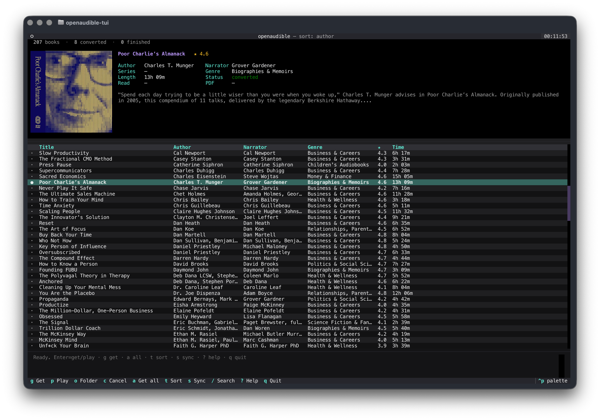

<div align="center">

# openaudible-py

**Sync, de-DRM, convert, and play your *own* Audible library — from the terminal.**

Most Python Audible tools are command-line only. This one is a full-screen **TUI**
— cover art, live progress, search, sort, one-key downloads — with a scriptable
CLI underneath. An open-source take on OpenAudible.



</div>

---

## Features

<table>
<tr>
<td valign="top" width="33%">

### Library
Searchable, sortable list
(author · title · recently bought),
cover art, and a status bar.
Info panel with metadata,
rating, and description.

</td>
<td valign="top" width="33%">

### Get
Download → strip DRM → **M4B**
with chapters, cover & tags.
Companion **PDFs**, a background
**queue**, cancel, and resumable
downloads.

</td>
<td valign="top" width="33%">

### Play
**Built-in** audio player —
pause, chapter skip, speed,
seek — without leaving the
keyboard.

</td>
</tr>
<tr>
<td valign="top" width="33%">

### Manage
Read status, **edit metadata**,
auto-fill from Audible, and
**import** your own local
audiobooks.

</td>
<td valign="top" width="33%">

### Account
Browser **login** (auto-captured),
logout, and any marketplace
(`us` · `uk` · `de` · `fr` · …).

</td>
<td valign="top" width="33%">

### Terminal-native
Keyboard-first, SSH-able,
**crisp covers** on graphics
terminals, purple/mint theme,
CSV/JSON export.

</td>
</tr>
</table>

> [!WARNING]
> **For personal use with your own purchased audiobooks and credentials.**
> DRM removal runs locally, on books you own.
>
> Removing DRM and the legality of doing so vary by country (e.g. the US
> DMCA §1201 anti-circumvention provisions, and equivalent laws elsewhere).
> **You are solely responsible for ensuring your use complies with the laws of
> your jurisdiction and with Audible's terms of service.** This software is
> provided for lawful personal use only; the authors accept no liability for
> misuse. If DRM circumvention is restricted where you live, do not use it.

> [!IMPORTANT]
> **Anti-piracy notice.** This project does **not** crack or break DRM. It uses
> *your own* decryption key — fetched from Audible's servers with your own
> credentials — to decrypt audiobooks **you have purchased**, exactly as the
> official Audible app does on your behalf.
>
> Use it only to gain full access to **your own** library: archiving, format
> conversion, convenience. **De-DRMed audiobooks must never be uploaded to
> public servers, torrents, or any form of mass distribution.** No help will be
> given to anyone doing this.
>
> **SUPPORT AUTHORS. BUY BOOKS.** Writers, narrators, retailers, and publishers
> all need to make a living so they can keep producing the audiobooks we love.
>
> **DON'T BE A PARASITE.**

## Install

```sh
git clone https://github.com/hjbarraza/openaudible-py.git
cd openaudible-py
./setup.sh        # installs deps, builds the venv, links commands onto PATH
openaudible-tui
```

`setup.sh` is idempotent and fully automatic on macOS and Linux:

| Step | macOS | Linux (Arch) | Linux (apt/dnf) |
|---|---|---|---|
| Package manager | Homebrew (auto-installed) | `pacman` | `apt-get` / `dnf` |
| ffmpeg + mpv | `brew install` | `pacman -S` | `apt-get install` |
| Python 3.12 | `uv` (auto-downloaded) | `uv` (auto-downloaded) | `uv` (auto-downloaded) |
| Browser login | Playwright webkit | System `chromium` | Playwright webkit |

On first run, the app opens a browser to sign in and **automatically syncs your library** once authenticated. Crisp covers need a graphics terminal (Ghostty · Kitty · WezTerm · iTerm2).

<details><summary>Manual install</summary>

```sh
# macOS
brew install ffmpeg mpv
# Linux (Arch)
sudo pacman -S ffmpeg mpv chromium
# Linux (Debian/Ubuntu)
sudo apt install ffmpeg mpv libmpv2

uv venv .venv --python 3.12 && . .venv/bin/activate
uv pip install -e .
playwright install webkit        # macOS / Debian; not needed on Arch
openaudible-tui
```
</details>

## Keys

| | | | |
|---|---|---|---|
| `Enter` get / play | `g` get | `a` get all | `c` cancel |
| `p` play | `o` folder | `m` read status | `n` notes |
| `e` edit | `F` auto-fill | `T` transcribe&nbsp;* | `t` sort |
| `/` search | `s` sync | `l` / `L` log in / out | `r` refresh |
| `?` help | `q` quit | | |

\* `T` transcribes with local Whisper, downloading + converting the book first if it isn't local yet — so `g` is no longer needed before it.

Movement: `j` `k`, arrows, PgUp/PgDn, Home/End, `Ctrl+U` / `Ctrl+D`.
Player: `space` pause · `x` stop · `[` `]` chapter · `-` `=` speed · `f` `b` ±30s.

## CLI

```sh
openaudible login                       # browser login (auto-captures)
openaudible sync                        # pull your library
openaudible ls [query]                  # list / search
openaudible get <ASIN>                  # download + de-DRM + convert (+ PDF)
openaudible get <ASIN> --transcribe     # ...and transcribe with local Whisper
openaudible transcribe <ASIN>           # transcribe a converted book (local Whisper)
openaudible play <ASIN>                 # open in your OS player
openaudible read <ASIN> finished        # set read status
openaudible edit <ASIN> --title "..."   # edit metadata
openaudible autofill <ASIN>             # re-fetch metadata from Audible
openaudible import <path>               # import local audiobooks
openaudible export library.json         # export catalog (.json / .csv)
openaudible logout                      # deregister + clear credentials
```

`OPENAUDIBLE_NO_PDF=1` skips companion PDFs · `OPENAUDIBLE_DELETE_AAX=1` deletes
the encrypted source after converting · `OPENAUDIBLE_COVER=blocks` forces
pixelated block covers (auto-used on Warp / Apple Terminal, which can't draw
real images).

## Files

| What | Where |
|---|---|
| Converted books | `~/Documents/audiobooks/<Author>/<Title>.m4b`  (`OPENAUDIBLE_BOOKS`) |
| App state (login, catalog, sources) | `~/Library/Application Support/openaudible-py/`  (`OPENAUDIBLE_HOME`) |

## How de-DRM works

Authenticates with your Audible account, requests each book's content license,
and uses the returned voucher (AAXC `key`/`iv`) or your account activation bytes
(legacy AAX) so `ffmpeg` can strip DRM and remux to M4B — lossless, no re-encode.
Chapters and cover art are preserved.

## Develop

```sh
pip install -e ".[dev]"
pytest
```

## License

[MIT](LICENSE)
